<h1 align="center">🐞 Bug Tracker</h1>

 ##  About the Project

The Bug Tracker System is a full-stack web application developed to streamline the process of tracking, managing, and resolving software bugs and tasks within a project. It provides a centralized platform where teams can collaborate effectively by creating projects, reporting issues, assigning responsibilities, and monitoring progress in real time.

The application follows a Kanban-based workflow, allowing users to visually track the lifecycle of an issue as it moves through different stages such as TODO, IN\_PROGRESS, and DONE. This visual representation helps teams quickly understand project status, identify bottlenecks, and improve productivity.

Security is a core focus of the system. It uses JWT-based authentication and role-based authorization to ensure that only authorized users can access and modify project data. Different roles help maintain accountability and prevent unauthorized actions.

The Bug Tracker System closely mimics real-world Agile and Scrum practices, making it suitable for software development teams and organizations that follow iterative development models. By combining secure authentication, structured issue management, and an intuitive user interface, this project demonstrates a practical, industry-relevant solution for modern software project management.

\_\_\_\_\_\_\_\_\_\_\_\_\_\_\_\_\_\_\_\_\_\_\_\_\_\_\_\_\_\_\_\_\_\_\_\_\_\_\_\_

## 🎯 Aim of the Project

The primary aim of the Bug Tracker System is to design and develop a centralized, secure, and user-friendly application that helps software teams efficiently manage bugs and tasks throughout the software development lifecycle.

The project aims to:

•	Provide a single centralized platform to log, track, and manage software bugs and issues across multiple projects.

•	Enhance team collaboration by allowing users to assign tasks, add comments, and track ownership of issues.

•	Improve accountability and transparency by clearly defining issue status, assignee, and progress at every stage.

•	Ensure secure access to the system using JWT-based authentication and role-based authorization.

•	Enable real-time visualization of issue progress through a Kanban board with drag-and-drop functionality.

•	Reduce manual tracking, miscommunication, and delays in bug resolution.

•	Simulate real-world Agile and Scrum workflows, preparing the system for practical industry use.

\_\_\_\_\_\_\_\_\_\_\_\_\_\_\_\_\_\_\_\_\_\_\_\_\_\_\_\_\_\_\_\_\_\_\_\_\_\_\_\_

## 📝 Project Introduction

In modern software development environments, managing bugs and tasks using manual methods such as spreadsheets or email communication often leads to miscommunication, lack of visibility, delayed issue resolution, and missed deadlines. As projects grow in size and team members increase, the need for a structured and reliable issue tracking system becomes essential.

The Bug Tracker application addresses these challenges by providing a centralized, secure, and well-organized platform for managing software bugs and project tasks. The system enables users to log in securely, create and manage projects, report issues, assign tasks to team members, and monitor progress in real time.

By implementing a Kanban-based workflow, the application allows teams to visualize the status of issues at every stage of development, from initial reporting to completion. Built with modern full-stack technologies and following industry-standard practices, this project reflects how real-world software teams track issues, collaborate efficiently, and maintain accountability throughout the software development lifecycle.

\_\_\_\_\_\_\_\_\_\_\_\_\_\_\_\_\_\_\_\_\_\_\_\_\_\_\_\_\_\_\_\_\_\_\_\_\_\_\_\_

## 📖 Project Summary

The Bug Tracker application is a full-stack solution designed to efficiently manage software bugs and tasks across projects. It provides a secure and structured environment where users can collaborate, track progress, and maintain accountability throughout the development lifecycle.

The application:

•	Uses JWT-based authentication to ensure secure user access and protect backend APIs.

•	Implements role-based authorization, allowing controlled access to features based on user roles such as Admin and Member.

•	Provides complete CRUD (Create, Read, Update, Delete) operations for managing projects, issues, and assignments.

•	Includes an interactive Kanban board with drag-and-drop functionality, enabling users to easily update issue statuses and visualize workflow progress.

•	Supports real-time issue tracking and team collaboration through comments, assignments, and status updates.

•	The project is built using Spring Boot for the backend and React for the frontend, following industry-standard layered architecture and best practices. It demonstrates practical implementation of secure authentication, RESTful APIs, and modern frontend development, making it suitable for real-world software development scenarios.

\_\_\_\_\_\_\_\_\_\_\_\_\_\_\_\_\_\_\_\_\_\_\_\_\_\_\_\_\_\_\_\_\_\_\_\_\_\_\_\_

## 🏗️ System Architecture

The Bug Tracker System follows a **3-Tier Architecture**, commonly used in enterprise applications.

### 🔹 Presentation Layer (Frontend)
- User interacts through a Web Browser
- Built using **React**
- Provides:
  - Login & Registration
  - Dashboard
  - Kanban Board
  - Filters and Search

### 🔹 Application Layer (Backend)
- Built using **Spring Boot**
- Exposes secured REST APIs
- Responsible for:
  - Request handling (Controllers)
  - Business logic (Services)
  - Authentication & Authorization (JWT)

### 🔹 Data Layer (Database)
- Uses **MySQL / PostgreSQL**
- Manages persistent data:
  - Users
  - Projects
  - Issues
  - Comments
  - Roles

This architecture improves **scalability, maintainability, and security** by clearly separating responsibilities.
\_\_\_\_\_\_\_\_\_\_\_\_\_\_\_\_\_\_\_\_\_\_\_\_\_\_\_\_\_\_\_\_\_\_\_\_\_\_\_\_

## 🛠️ Tech Stack

### 🔙 Backend

Java 17
Used as the core programming language for building a stable, high-performance backend with long-term support features.

Spring Boot
Simplifies backend development by providing auto-configuration, embedded server support, and rapid REST API development.

Spring Security
Handles authentication and authorization, protecting APIs and enforcing role-based access control across the application.

JWT (JSON Web Token)
Enables secure, stateless authentication by generating tokens after login and validating them for every protected request.

JPA / Hibernate
Used for ORM (Object Relational Mapping) to map Java entities to database tables and handle CRUD operations efficiently.

MySQL / PostgreSQL
Relational databases used to persist application data such as users, projects, issues, comments, and roles.

Swagger (API Documentation)
Provides interactive API documentation, making it easy to test and understand backend endpoints.

### 🔜 Frontend

React
Used to build a dynamic, component-based user interface with efficient state management.

Axios
Handles HTTP communication between the frontend and backend, including sending JWT tokens with secured requests.

React Hooks
Enables state and lifecycle management in functional components, improving code readability and reuse.

HTML5 & CSS3
Used to structure and style the user interface, ensuring responsiveness and clean layouts.

Drag & Drop API
Implements Kanban board functionality, allowing users to move issues between workflow stages visually.

### ⚙️ Tools

Git & GitHub
Used for version control, source code management, and collaboration.

Postman
Helps in testing and validating REST APIs during development.

Render / Railway (Deployment)
Used for deploying backend services and hosting the application in a cloud environment.

\_\_\_\_\_\_\_\_\_\_\_\_\_\_\_\_\_\_\_\_\_\_\_\_\_\_\_\_\_\_\_\_\_\_\_\_\_\_\_\_

## 👥 Use Cases

###1\. User Authentication

The User Authentication module ensures that only authorized users can access the Bug Tracker application and perform actions based on their permissions. Security is implemented using JWT (JSON Web Token) authentication.

Key Functionality:

•	Users can register by providing valid credentials such as name, email, and password.

•	Registered users can log in securely using their credentials.

•	Upon successful login, the backend generates a JWT token.

•	The JWT token is sent to the frontend and stored securely (e.g., in memory or local storage).

•	For every subsequent API request, the token is attached to the request header.

•	The backend validates the JWT token before allowing access to protected endpoints.

•	Unauthorized or expired tokens are rejected, ensuring system security

### 2\. Project Management

The Project Management module allows users to organize work by creating and managing projects within the Bug Tracker system. Each project acts as a container for issues, team members, and workflows.

Key Functionality:

•	Users can create new projects by providing project details such as name and description.

•	Project owners or admins can view detailed project information, including project status and associated issues.

•	The system supports project member management, enabling admins to add or remove users from a project.

•	Roles can be assigned to project members to control access and responsibilities.

•	Only authorized users can perform project-level actions, ensuring secure and controlled collaboration.

### 3\. Issue Management

The Issue Management module is the core functionality of the Bug Tracker system, responsible for handling the complete lifecycle of bugs and tasks within a project. It ensures that issues are properly recorded, tracked, and resolved in an organized manner.

Key Functionality:

•	Users can create new bugs or issues by providing details such as title, description, priority, and associated project.

•	Issues can be edited or deleted by authorized users, allowing updates when requirements or bug details change.

•	Each issue can be assigned to a specific user, ensuring clear responsibility and ownership.

•	Users can update the issue status (TODO, IN\_PROGRESS, DONE) as work progresses.

•	All updates are reflected immediately in the system, keeping the issue information up to date.

### 4\. Kanban Workflow

The Kanban Workflow module provides a visual and interactive way to track the progress of issues throughout their lifecycle. It helps teams understand the current state of work at a glance and manage tasks more efficiently.

Key Functionality:

•	Issues are organized into three workflow columns:

o	TODO – Newly created issues that are yet to be started

o	IN\_PROGRESS – Issues currently being worked on

o	DONE – Completed and resolved issues

•	Each issue is displayed as a card within its respective column.

•	Users can drag and drop issue cards between columns to reflect progress.

•	When an issue is moved, the system automatically updates the issue status in the backend database.

•	The Kanban board refreshes dynamically, ensuring the UI always reflects the latest state.

### 5\. Authorization

The Authorization module ensures that users can perform actions only within the limits of their assigned roles and permissions. This helps maintain data integrity, security, and accountability across the Bug Tracker system.

Key Functionality:

•	The system implements role-based authorization to control access to features and resources.

•	Only authorized users (such as issue creators, assignees, or admins) can edit or delete issues.

•	Users without sufficient permissions can view issues but are restricted from modifying them.

•	Admin users have higher privileges, including:

o	Managing project members and roles

o	Performing sensitive actions such as deleting issues or projects

o	Overseeing overall project activity

•	Authorization rules are enforced at the backend level using Spring Security to prevent unauthorized API access.

\_\_\_\_\_\_\_\_\_\_\_\_\_\_\_\_\_\_\_\_\_\_\_\_\_\_\_\_\_\_\_\_\_\_\_\_\_\_\_\_

## 🖼️ Screenshots \& Functionality Explanation

 ## Register page

The Register Page allows new users to create an account in the Bug Tracker system. It ensures controlled and secure onboarding of users into the application.

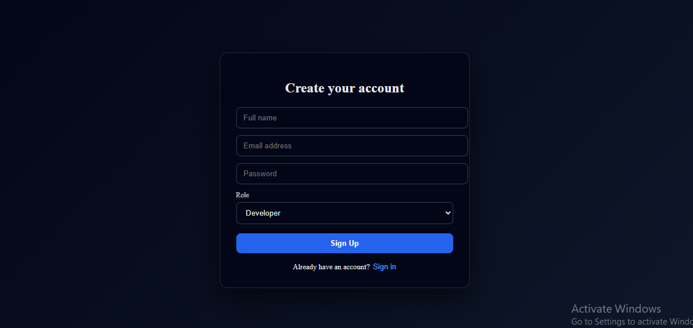

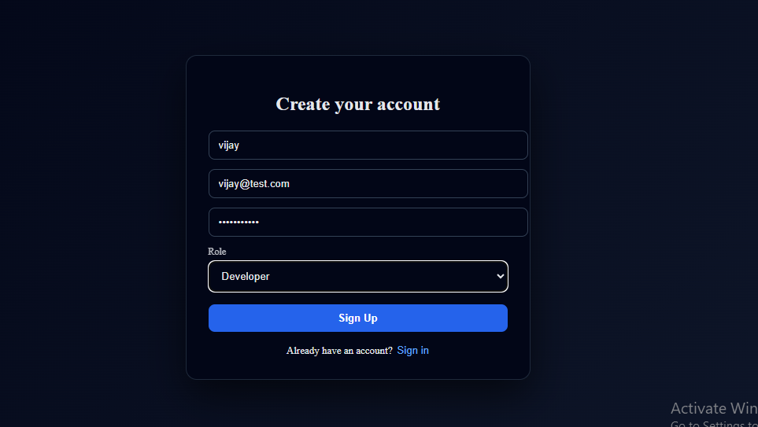

Functionality:

Users enter required details such as name, email, and password.

Frontend validation ensures all mandatory fields are provided.

Registration data is securely sent to the backend.

The backend checks for duplicate users using the email address.

Passwords are securely encrypted before being stored in the database.

On successful registration, the user is allowed to log in to the application.

## Login Page 

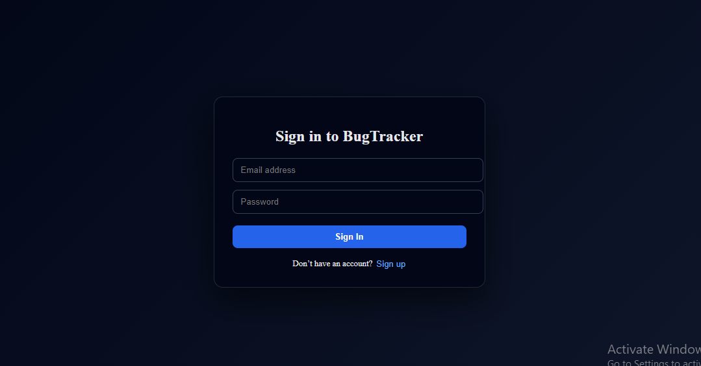

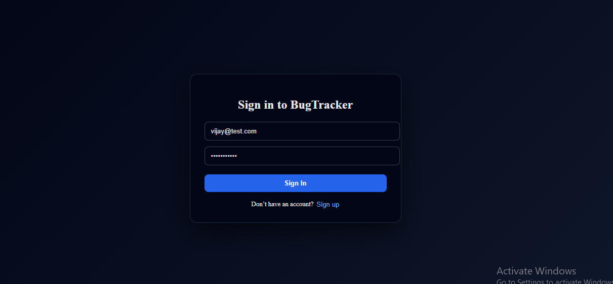

The Login Page serves as the secure entry point to the Bug Tracker application. It ensures that only registered users can access the system and perform authorized actions.

Functionality:

\- The user enters their registered email and password into the login form.

\- Input validation is performed on the frontend to ensure required fields are not empty.

\- The credentials are securely sent to the backend using a REST API.

\- The backend validates the credentials against stored user data.

\- Upon successful authentication, a JWT (JSON Web Token) is generated.

\- The token is returned to the frontend and stored securely for subsequent requests.

\- All protected API calls include this token in the request header.

\- If authentication fails, appropriate error messages are displayed to the user.

--------------------------------------------------

## Dashboard

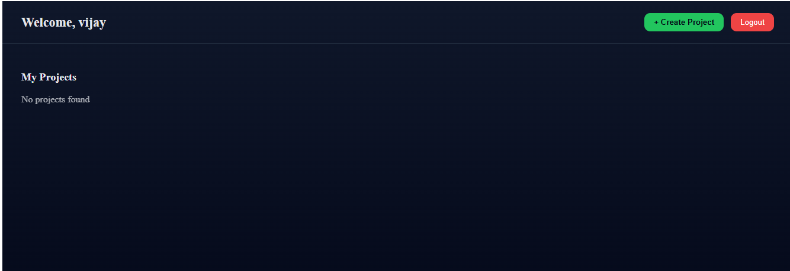

The Dashboard is the central landing page of the Bug Tracker application after a user logs in.

Functionality:

\- Displays logged-in user details such as username or email.

\- Shows a list of projects the user is associated with.

\- Allows navigation to individual project boards.

\- Ensures role-based project visibility.

--------------------------------------------------

## Create Project Option (Dashboard)

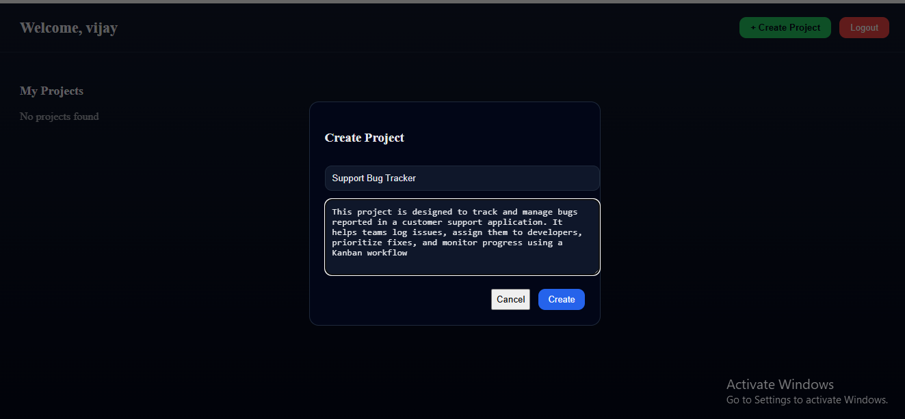

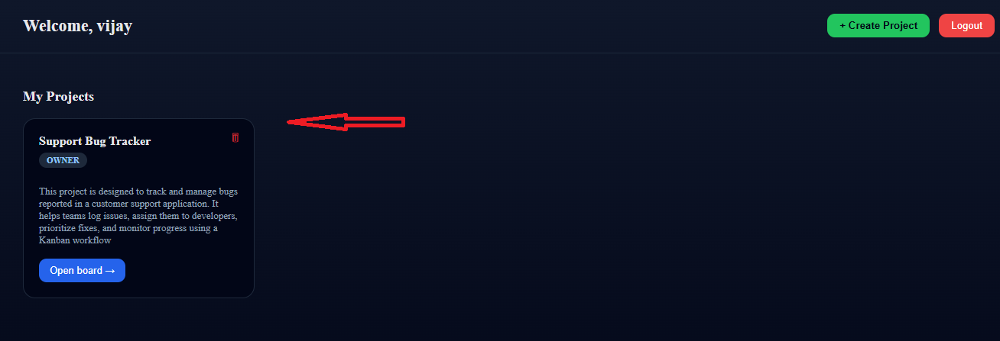

Functionality:

•	Users can access the Create Project option directly from the Dashboard.

•	A dedicated form or modal opens where users can enter:

o	Project name

o	Project description

•	Basic validation ensures mandatory fields are filled before submission.

•	On submission, project details are securely sent to the backend.

•	The backend creates a new project and associates it with the logged-in user as the project owner or admin.

•	The newly created project appears instantly in the Dashboard project list.

•	Users can navigate to the project board directly from the Dashboard.

--------------------------------------------------

## Logout Option (Dashboard)

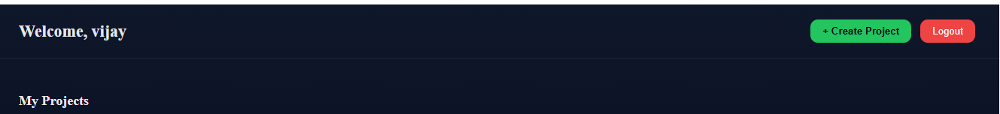

Functionality:

•	The Logout option is accessible from the Dashboard header or navigation menu.

•	When selected, the application:

o	Clears the stored JWT token from the browser.

o	Resets user-related state data in the frontend.

•	The user is immediately redirected to the Login page.

•	Any attempt to access protected pages after logout is blocked.

--------------------------------------------------

## Delete Project Option

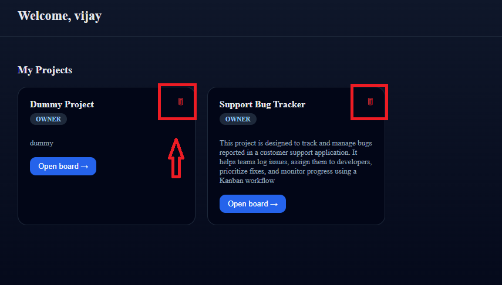

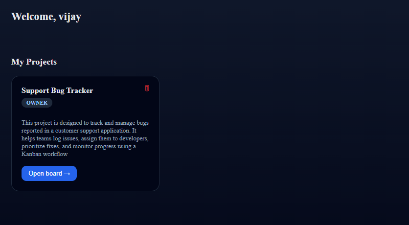

Functionality:

•	The Delete Project option is available from the project settings or dashboard (for authorized users).

•	When selected, the system displays a confirmation prompt to prevent accidental deletion.

•	Upon confirmation, a delete request is securely sent to the backend.

•	The backend verifies the user’s role and permissions before proceeding.

•	If authorized, the project and all its associated data (issues, comments, assignments) are removed from the database.

•	The dashboard updates immediately to reflect the removal of the project.

--------------------------------------------------

## Open Board Option

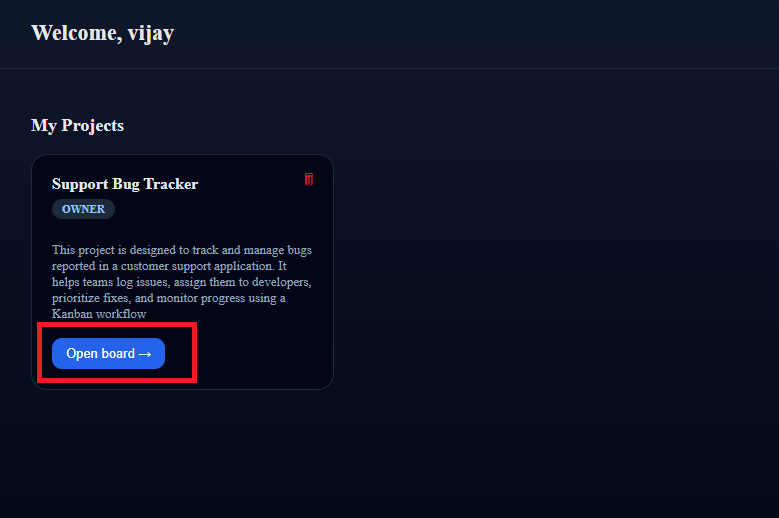

Functionality:

•	Each project listed on the Dashboard includes an Open Board button.

•	When clicked, the user is navigated to the Kanban board view of the selected project.

•	The system loads all issues associated with that project.

•	Issues are displayed in their respective workflow columns:

o	TODO

o	IN\_PROGRESS

o	DONE

•	The board reflects the most recent state of the project, ensuring up-to-date information

--------------------------------------------------

## Issue Creation
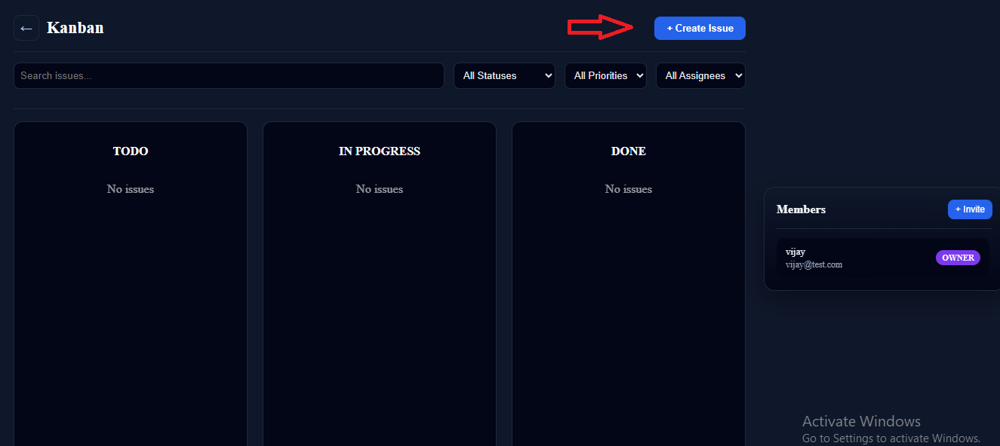

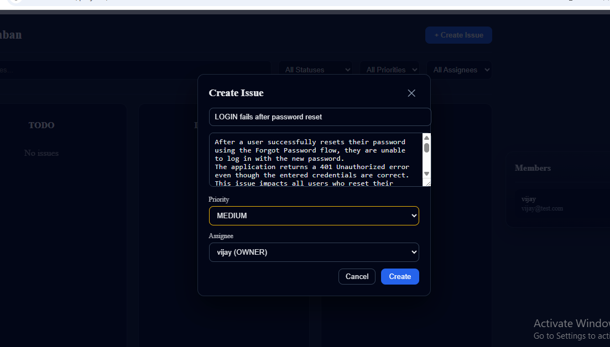

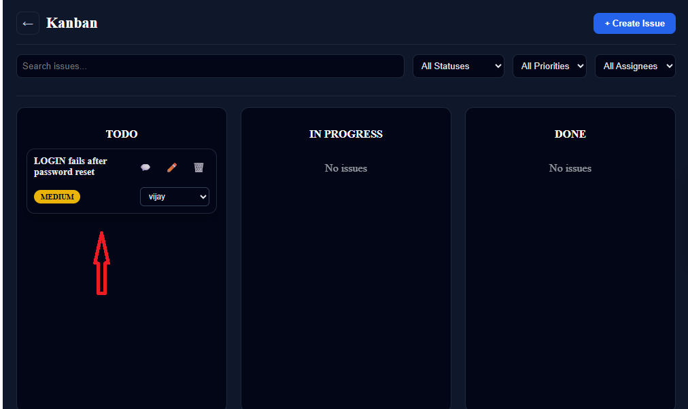

Functionality:

•	Users can create new issues through a dedicated form or modal.

•	Each issue includes key details such as:

o	Title – a brief summary of the bug or task

o	Description – detailed explanation of the issue

o	Priority – to indicate urgency or importance

o	Assignee – the team member responsible for resolving the issue

•	The system performs basic validation to ensure mandatory fields are provided.

•	Upon submission, the issue data is securely sent to the backend.

•	The issue is saved in the database and linked to the selected project.

•	Newly created issues automatically appear on the Kanban board under the appropriate status (usually TODO).

---

## Kanban Board

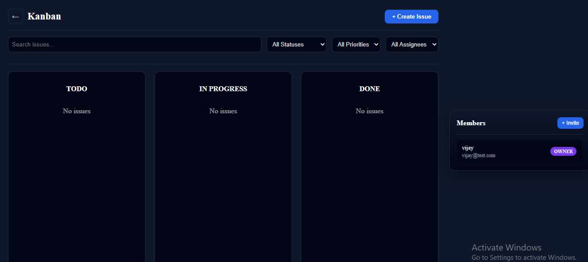

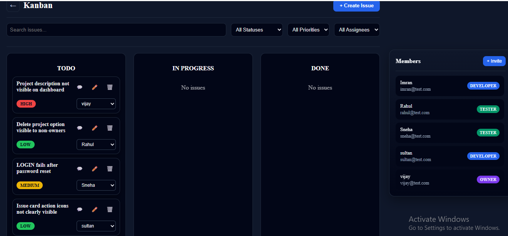

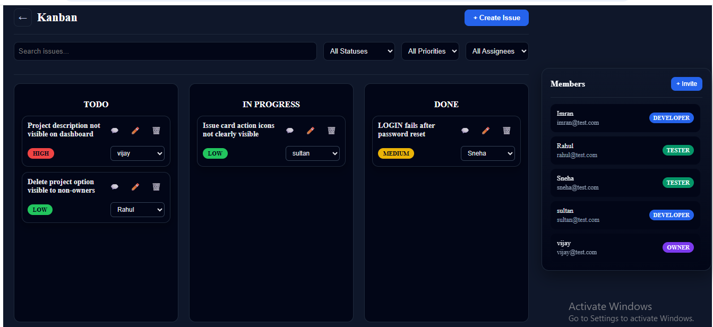

Functionality:

•	Issues are displayed as cards and organized into columns based on their current status:

o	TODO

o	IN\_PROGRESS

o	DONE

•	Each issue card contains essential information such as title, assignee, and priority.

•	Users can drag and drop issue cards between columns to update their status.

•	When an issue is moved, the new status is automatically updated in the backend.

•	The board refreshes dynamically, ensuring real-time visual progress tracking for all users.

--------------------------------------------------

## Comments Option

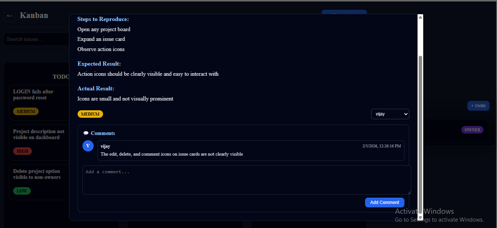

Functionality:

•	Users can add comments to an issue at any stage of its lifecycle.

•	Comments are displayed in chronological order, creating a clear discussion thread.

•	Each comment is associated with the author and timestamp, ensuring traceability.

•	All comments are stored securely in the database and linked to the respective issue.

•	The comment history remains available even after the issue is completed or closed.

--------------------------------------------------

## Edit Issue Option

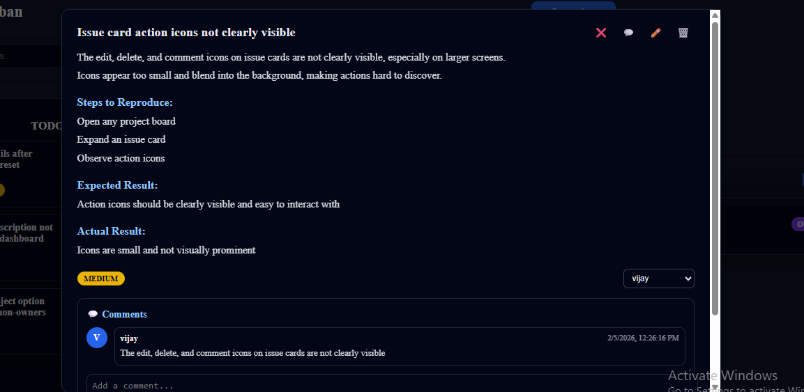

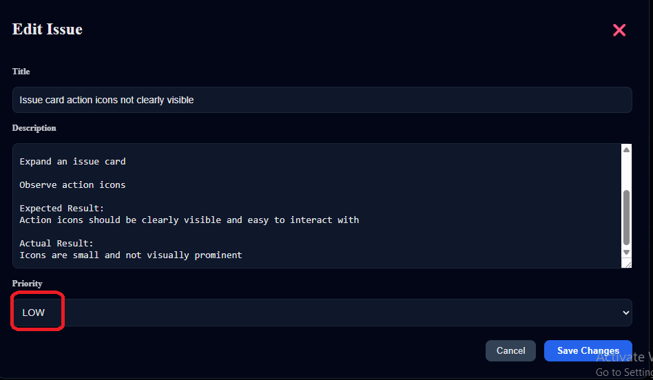

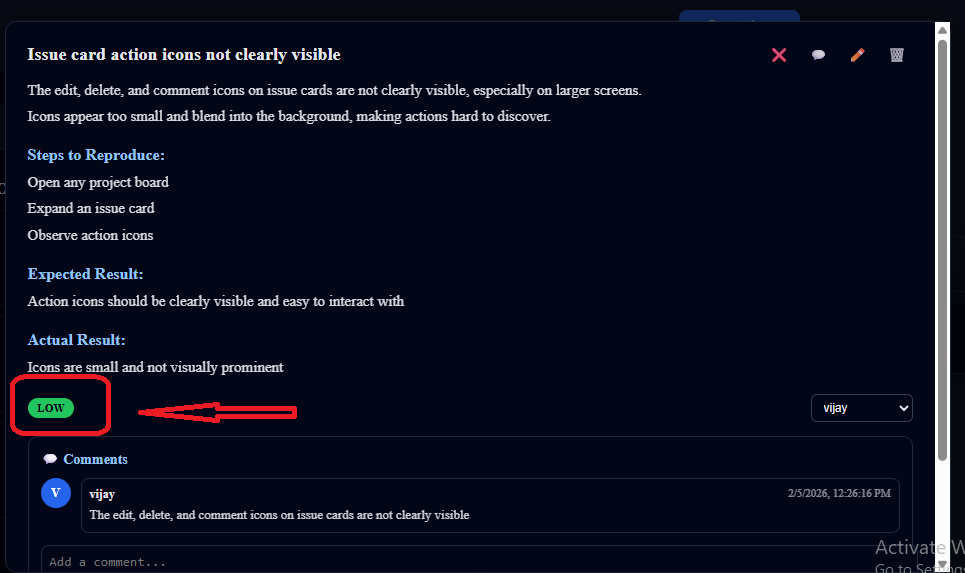

Functionality:

•	Users can open the Edit Issue form from an existing issue card.

•	The form is pre-filled with current issue details, making updates easy and error-free.

•	Users can edit fields such as:

o	Issue title

o	Description

o	Priority

o	Assignee

o	Status (if permitted)

•	On submission, the updated data is sent securely to the backend.

•	The backend validates user permissions before applying changes.

•	Once updated, the changes are saved to the database and immediately reflected on the Kanban board.

--------------------------------------------------

## Delete Issue Option

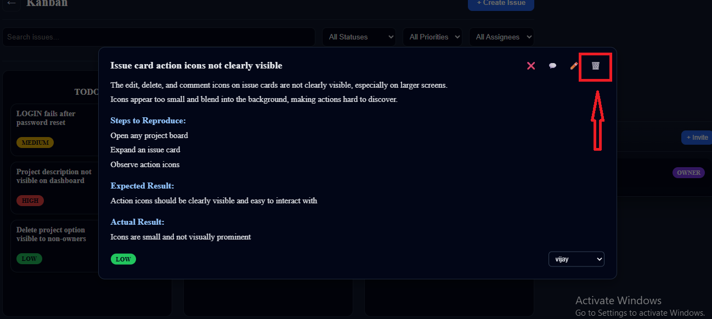

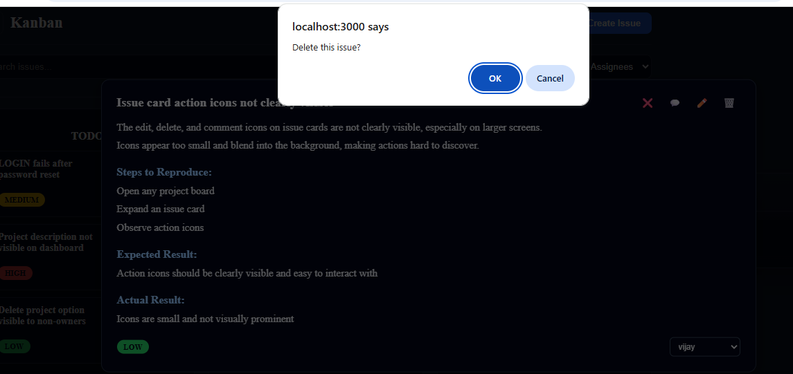

Functionality:

•	Authorized users can initiate the Delete Issue action from the issue card or issue details view.

•	Before deletion, the system prompts a confirmation dialog to prevent accidental removals.

•	Once confirmed, a delete request is sent securely to the backend.

•	The backend verifies user authorization before performing the delete operation.

•	If authorized, the issue is removed from the database.

•	The Kanban board and related views update immediately to reflect the deletion.

--------------------------------------------------

## Minimize \& Maximize Issue Option

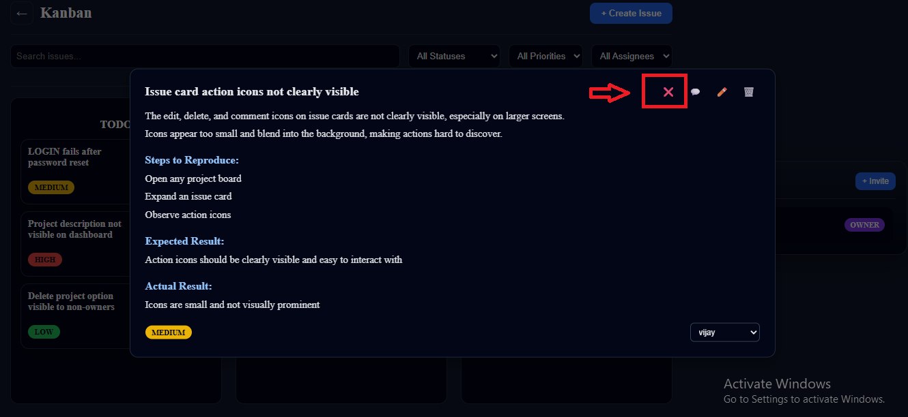

Functionality:

•	Each issue card can be minimized to show only essential details such as:

o	Issue title

o	Current status

•	Users can maximize (expand) an issue card to view complete information, including:

o	Description

o	Priority

o	Assignee

o	Comments and actions (Edit/Delete)

•	The toggle between minimized and maximized views happens instantly without reloading the page.

•	The expanded view allows users to take quick actions directly from the issue card.

--------------------------------------------------

## Issue Assign Option

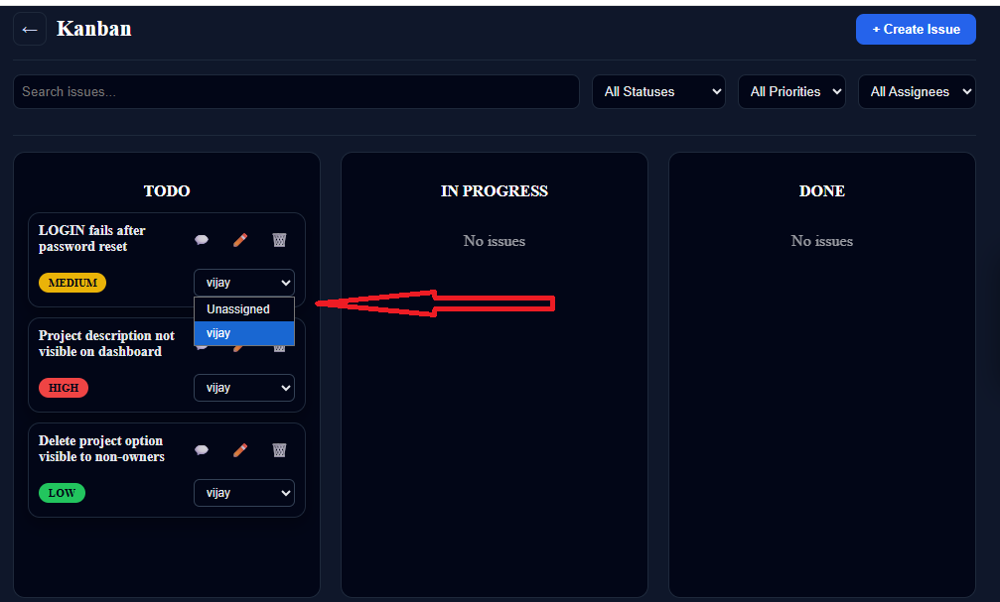

Functionality:

•	Authorized users can assign an issue to a project member from the available users list.

•	Assignment can be done during issue creation or later through the Edit Issue option.

•	The selected assignee is stored and linked to the issue in the backend database.

•	The assignee’s name is displayed on the issue card for easy identification.

•	Assigned issues appear under the assignee’s responsibility and can be tracked easily using filters.

-----------------------------------------------------

## Search Issues

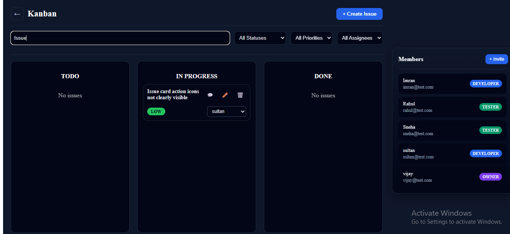

Functionality:

•	Users can type keywords into the Search Issues input field.

•	The search dynamically filters issues based on:

o	Issue title

o	Keywords present in the description

•	Results update instantly without page reload.

•	Search works across all Kanban columns (TODO, IN\_PROGRESS, DONE).

--------------------------------------------------

## Filters

The filter dropdowns allow users to narrow down issues based on specific criteria.

### Filter by Status

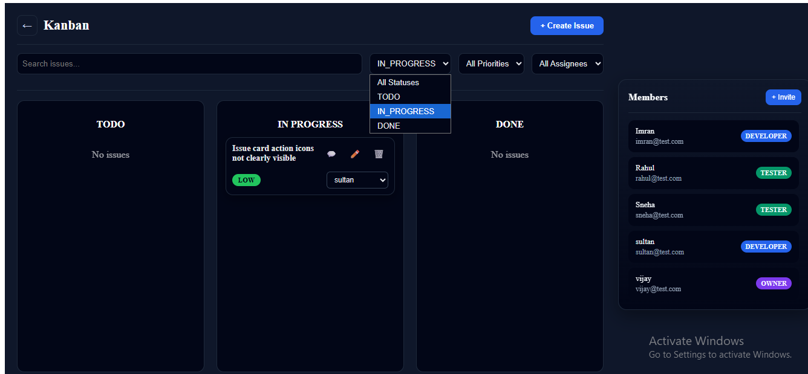

### Filter by Priority

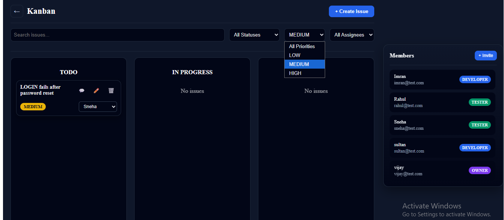

### Filter by Assignee

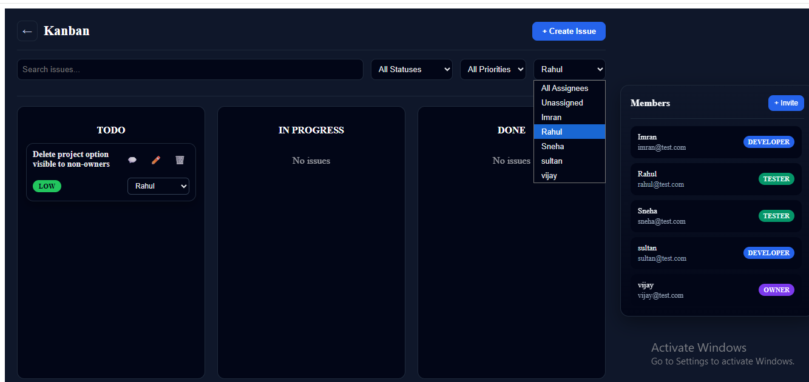

--------------------------------------------------

## Invite Members Option

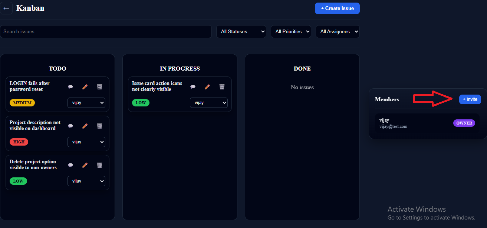

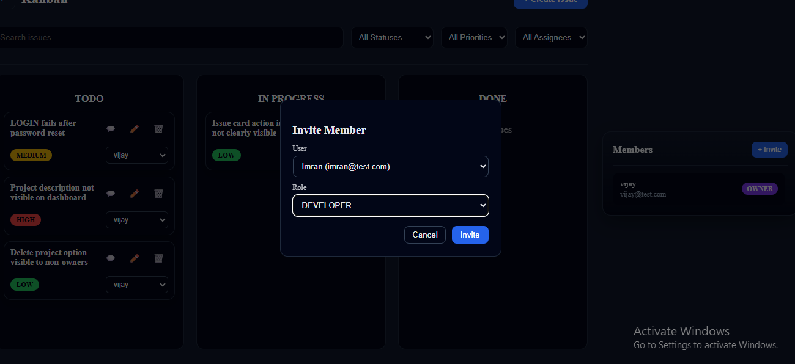

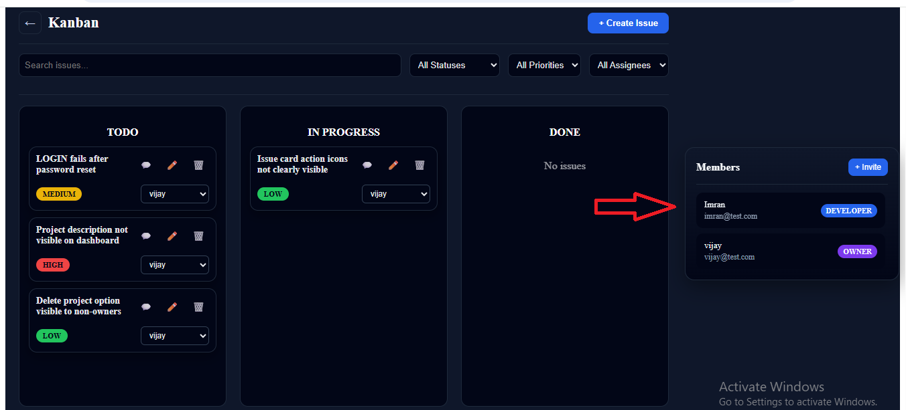

Functionality:

•	The Invite Members option is available within the project or project members section.

•	Authorized users (Admin / Project Owner) can invite members by providing:

o	User email address

o	Assigned role (if applicable)

•	The system validates whether the invited user already exists.

•	If valid, the user is added to the project as a project member.

•	The newly invited member immediately gains access to the project board.

•	Invited members can view issues, add comments, and work on assigned tasks based on their role.

----------------------------------------------------------

## 🚀 Future Enhancements

The Bug Tracker system is designed with scalability in mind, and several enhancements can be implemented to further improve functionality, usability, and performance.

•	Email notifications for issue updates

•	File attachment support for bugs

•	Role-based dashboards

•	Activity logs and audit trails

•	WebSocket-based real-time updates

•	Advanced filters and pagination

These enhancements would make the Bug Tracker system more robust, scalable, and enterprise-ready, aligning it closely with professional tools used in real-world software development environments.

\_\_\_\_\_\_\_\_\_\_\_\_\_\_\_\_\_\_\_\_\_\_\_\_\_\_\_\_\_\_\_\_\_\_\_\_\_\_\_\_

## ✅ Conclusion

The Bug Tracker project successfully demonstrates a comprehensive understanding of full-stack application development by integrating a secure backend with an interactive and user-friendly frontend. It showcases the practical implementation of Spring Boot, Spring Security, and JWT authentication, ensuring secure access and controlled authorization across the system.

The project reflects real-world issue tracking workflows through features such as project management, issue lifecycle handling, Kanban-based progress visualization, role-based permissions, and collaborative tools like comments and member management. These features closely resemble how professional software teams manage bugs and tasks in Agile and Scrum environments.

With its clean, modular, and scalable architecture, the application is easy to maintain and extend with future enhancements such as notifications, real-time updates, and advanced reporting. Overall, this project serves as a strong demonstration of industry-relevant skills and is highly suitable for technical interviews, live demonstrations, and production-level learning

